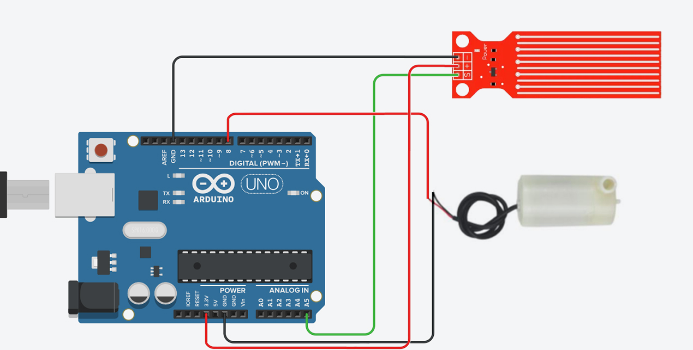
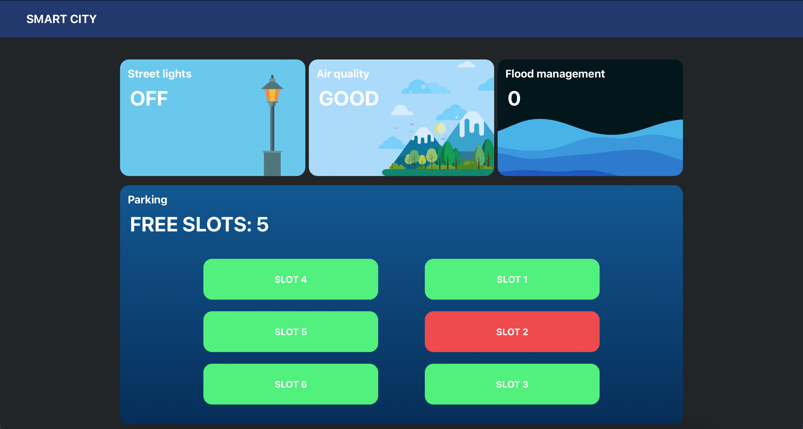

# Smart City with Arduino 🏙

<p align="center"></p>

This project treats the development of an IoT smart city using Arduino. The smart city will be equipped with the following functionalities:
- Smart lighting;
- Smart parking;
- Air quality monitoring;
- Flood management;

Each feature will be explained in the dedicated sections.

## Table of contents
* [Getting started](#getting-started-)
  * [1. Host over RaspberryPi 3](#1-host-over-raspberrypi-3)
  * [2. Host on your PC](#2-host-on-your-pc)
* [Materials used in the project](#materials-used-in-the-project-)
* [Step 1: Box creation](#step-1-box-creation)
* [Step 2: Single sections wiring and code](#step-2-single-sections-wiring-and-code)
  * [2.1: Smart lighting](#21-smart-lighting)
  * [2.2: Smart Parking](#22-smart-parking)
  * [2.3: Air quality monitoring](#23-air-quality-monitoring)
  * [2.4: Flood management](#24-flood-management)
* [Step 3: Create MQTT communication with Web Application](#step-3-create-mqtt-communication-with-web-application)
  * [3.1 Topics and messages format](#31-topics-and-messages-format)
  * [3.2 Publish messages using Arduino](#32-publish-messages-using-arduino)
  * [3.3 Receive messages using a Web Application](#33-receive-messages-using-a-web-application)
* [Step 4: Place all devices on the box model](#step-4-place-all-devices-on-the-box-model) 


## Getting started 🚀
Since our smart sensors can communicate, using MQTT, with a web-application built with Node-Red, we need to setup the enviroment. In our project we used a RaspberryPi 3 to host the MQTT broker and the web-application, but it's possible also to host them on your pc.

## 1. Host over RaspberryPi 3
As first step you need to do the initial setup for the RaspberryPi.
*  Insert a microSD card / reader into your computer.  
*  Download and install the official [Raspberry Pi Imager](https://www.raspberrypi.com/software/). 
*  Run the Imager program, choose the OS as Raspberry Pi OS (32-bit), choose the SD card and write the image. 

### 1.1 - Install MQTT broker
Install the MQTT broker.
```
apt-get install mosquitto
```
To modify the config file use:
```
sudo /etc/init.d/mosquitto stop
sudo nano /etc/mosquitto/mosquitto.conf
```
To autostart on boot use:
```
sudo systemctl enable mosquitto
sudo systemctl start mosquitto
```

### 1.2 - Install Node-RED
First, you need to check that npm is able to fetch and build any binary modules it needs to install.
```
sudo apt install build-essential git curl
```
With the following command you can install Node.js, npm and Node-RED.
```
bash <(curl -sL https://raw.githubusercontent.com/node-red/linux-installers/master/deb/update-nodejs-and-nodered)
```
To set the autostart on boot use:
```
sudo systemctl enable nodered.service
```
Now you can access to ``http://localhost:1880`` and you need to install the ``node-red-dashboard`` palette. Import the ``flows.json`` file. 

You also need to set the static images. To do that go in the ``./node-red`` folder, and modify the file ``settings.js`` with the following line: 
```javascript
...
    // When httpAdminRoot is used to move the UI to a different root path, the
    // following property can be used to identify a directory of static content
    // that should be served at http://localhost:1880/.
    // httpStatic: '/home/nol/node-red-static/',
    httpStatic: 'home/{{userName}}/.node-red/static' 
...

```
After, create the ``static`` folder in ``home/{{userName}}/.node-red``, putting inside all the pictures inside the folder ``dashboard_images``.

Finally restart your node-red.

## 2. Host on your PC
### 2.1 - Install MQTT broker
Install the MQTT broker and modify the file ```mosquitto.conf``` inserting the following lines to allow remote access:
```
listener 1885
allow_anonymous true
```
### 2.2 - Install Node-RED
- Download and install [Node.js](https://nodejs.org/en/);
- To ensure the correct installation run in the terminal:
```
node --version && npm –version
```
- Install Node-RED using: 
```
npm install -g --unsafe-perm node-red
```
- Execute:
```
node-red
```
- Now you can access to ``http://localhost:1880`` and you need to install the ``node-red-dashboard`` palette. NB: you need to import the flow and set the static images.

## Materials used in the project 📝
- Box:
  - 4mm thick plywood (1m x 1m);
  - 1.5cm x 1.5cm bar (3.2m);
  - Gray acrylic spray;
  
- Smart Lighting:
  - Light Sensor (Photoresistor);
  - Resistor 10k ohm;
  - Resistor 220 ohm (2x);
  - Yellow LED 5mm (6x);
  - [Street lamp 3D Model](https://www.printables.com/it/model/213148-street-lamp-controlled-by-raspberry-pi-pico) (50% scaled);
  - Solder Iron;
  
- Smart Parking:
  - IR Infrared Obstacle Avoidance Sensor Module (6x);
  - Light Sensor (Photoresistor) (2x);
  - Resistor 10k ohm (2x);
  - KY-008 Laser Module (2x);
  - Servo micro TowerPro sg90 9g;
  - 8x8 Dot Led Matrix Module;

- Air Quality Monitoring:
  - MQ2 Air Quality Sensor;
  
- Flood management:
  - Water Sensor;
  - Water pump 5V;
 

## Step 1: Box creation
<p align="center"></p>
Two steps were performed to create the box. For the bottom base (left in photo), a 40cm x 40cm square was cut out and 5cm high sides applied. To make the structure more solid, pieces of the 1.5cm x 1.5cm bar were cut out and applied in the corners. Fastening was done with wood glue and tacks. For the upper base (right in the photo), a 43cm x 43cm square was cut out, applying the sides and the 1.5cm x 1.5cm bar so that it would fit with the bottom base.
Finally, we painted the entire base with gray acrylic spray.

## Step 2: Single sections wiring and code
### 2.1: Smart lighting
<p align="center"></p>

The code for this section is available in the folder ``single_sections_code/StreetLights``.


### 2.2: Smart Parking
The various connections for building the smart parking lot have been divided for illustration purposes only. The first image shows the components needed to detect the presence of a car in each lot. The second image shows the components needed for entry and exit in the parking lot equipped with a bar and how available and occupied spaces are shown.

<p align="center"></p>
<p align="center"></p>

The code for this section is available in the folders ``single_sections_code/Parking`` and ``single_sections_code/ParkingBar``.

To use this code you need to install these libraries:
* [Servo](https://www.arduino.cc/reference/en/libraries/servo/);
* [LedControl](https://www.arduinolibraries.info/libraries/led-control).

### 2.3: Air quality monitoring
<p align="center"></p>

The code for this section is available in the folder ``single_sections_code/AirQuality``.


### 2.4: Flood management
<p align="center"></p>

The code for this section is available in the folder ``single_sections_code/FloodManagement``.


## Step 3: Create MQTT communication with Web Application
### 3.1 Topics and messages format
As first step, we estabilished all the topics for the communication:
-  ``topic/street_lights``
-  ``topic/air_quality``
-  ``topic/flood_management``
-  ``topic/parking``

Next, we specified the message format as follows:

```
STREET LIGHTS: 

--- {lights_status: value},

where "value" can be "0" if the lights are OFF, and "1" if they are ON.

```

```
AIR QUALITY MONITORING: 

--- {air_quality_status: value},

where "value" can be "0" if the air quality is GOOD, and "1" if it is BAD.

```

```
FLOOD MANAGEMENT: 

--- {flood_status: value},

where "value" is the water level.

```

```
PARKING: 

--- {free: value, slot1: status, slot2: status, slot3: status, slot4: status, slot5: status, slot6: status},

where "value" is the number of free slots and "status" that can be "1" if the slot is free, "0" if it is busy.

```
### 3.2 Publish messages using Arduino
To publish messages using Arduino we need to install the following libraries:
* [WiFiNINA](https://www.arduino.cc/reference/en/libraries/wifinina/);
* [PubSubClient](https://www.arduino.cc/reference/en/libraries/pubsubclient/).

All the scripts to send messages are in the folder ``single_sections_code_mqtt``.


### 3.3 Receive messages using a Web Application
To built the Web Application to receive and display messages, we used Node Red. The flow is ``flows.json``. The node configuration on Node Red consists of 5 nodes that receive messages from Arduino and are displayed in custom templates. The "template" node named ``custom_template`` was used to customize the style of the dashboard.

<p align="center"></p>

The final result is showed in the next picture. 
<p align="center"></p> 

## Step 4: Place all devices on the box model
We connected each sensor to an Arduino WIFI REV 2. The full code is in ``MainProgram``.
<p align="center"></p>


<br><br>
## FINAL RESULT OF EACH SECTION

## Smart lighting
Street lights use a photoresistor to capture the amount of light. At sunset the lights will turn on.

https://user-images.githubusercontent.com/72497905/215066779-0dc2bd54-4a1f-4323-9e29-403fe8a0ca50.mp4


## Smart parking
When the car attempts to enter the parking area, the bar will only open if there are spaces available. When the car occupies a certain slot it will be shown on the LED matrix which slot has been occupied. During the procedure all information will be shown on the dashboard.

https://user-images.githubusercontent.com/72497905/215062009-ff6e33ce-e29a-4978-98df-324dc9d6a496.mp4


## Air quality monitoring

https://user-images.githubusercontent.com/72497905/215070127-c38a5b98-5a0a-4aec-b4d0-cdd19695f3a9.mp4


## Flood management
When the water level is too high, an motor is activated that drains the water in another place to prevent the city from flooding.

## Developed with ❤️ by
[Simone Benedetto](https://github.com/BenedettoSimone)<br>
[Salerno Daniele](https://github.com/DanieleSalerno) 
